## 起因
由于和老婆讨(激烈)论(争吵)是否要生二胎的时候，顺口提到了蜡笔小新动画中小新家也是二胎家庭，然后突然发现动画设定的时间点和我国的当前的房价走势的时间点类似，特此年末之际，就偏娱乐性的从小新的爸爸-野原广志的视角，来间接感受一下当年日本在房价顶峰站岗的中产阶级的处境，并对比一下我国的中等收入群体，顺便看一下日本失去的二十年对我国的借鉴意义。  

## 日本的微观视角-野原广志

### 时间节点
《蜡笔小新》第一季动画上映于 1992 年，正好是日本房产泡沫刚刚破裂后 2 年，其中小新 1987 年出生，5 岁，小葵在剧中设定为 0 岁，可以认为其出生于 1992 年，广志 35 岁，美冴 29 岁；那么可知，小新出生在日本经济泡沫接近顶点的时候，而当美冴怀上小葵的时候，日本的经济泡沫正好刚刚破裂，但是当时他们可能认为这只是短暂的经济调整，而没有意识到接下来的是长达几十年的下行周期  

### 收入
根据动画第一季 262 集可知，广志的薪水是 30 万日元，这里指的是税后月收入，但是这里没把广志的夏季奖金和冬季奖金算进来。  
<div align="center">
    
</div>

在 1995 年的特别篇里，又提到了 1.3 亿日元的彩票，大约是广志 20 年的收入，换算过来广志的税前年收入可以认为约 650 万日元。  

92 年日本的个税税率大致为  
* 300万日元以下: 10%  
* 300万〜1000日元：20%  

那么可知广志的税后年薪为
```
300 * 0.9 + 350 * 0.8 = 550万日元
```

### 房屋
在动画中并没有直接提到房屋的价格和贷款金额，2019 年，有为名叫 `ニシキドアヤト` 的网友，在推上发了一个[帖子](https://x.com/art_0214/status/1166848223777943558)(可惜原帖链接中的完整博文已不可访问，不过好在网络上能很容易的找到当年相关的截图)，探讨了像《哆啦A梦》、《蜡笔小新》、《樱桃小丸子》和《海螺小姐》这些动画中，房屋的位置、平面图和大致价格  

<div align="center">
  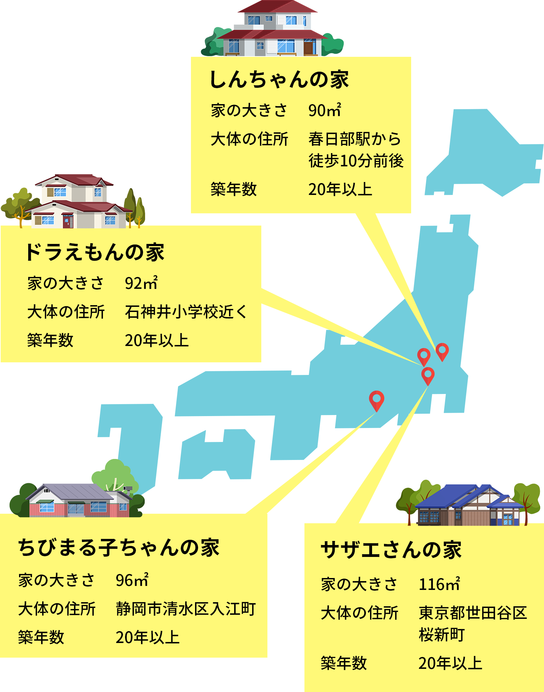
</div>
<div align="center">
  
</div>
<div align="center">
  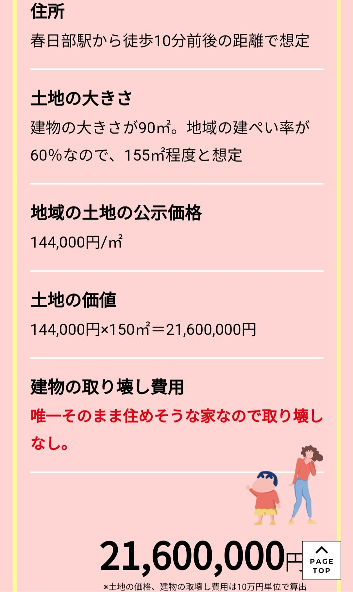
</div>

可以看到小新的家位于埼玉县春日部市，步行到春日部站在 10 分钟左右的时间，家的建筑面积为 90 平米，按照该地区建筑区域占土地面积比例为 60% 推算，其占地面积约为 150 平米，而按照 2019 年的价格估算为 2160 万日元。  
但是注意，这里的价格为 2019 年的价格，按照动画中设定，广志买入时间是 1990 年，正好在日本经济泡沫的顶点买入，那么广志的买入价格是多少呢？  

<div align="center">
  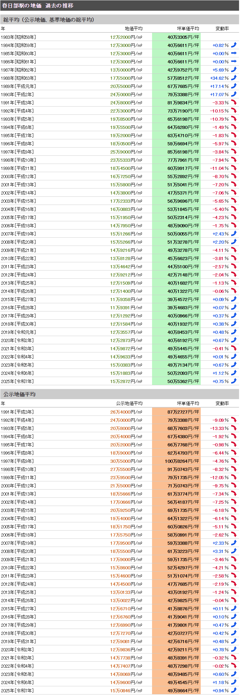  
</div>

和上面博文中的使用的价格类型保持一致，需要使用的应该是公示土地价格，但是此价格在 1991 年才第一次统计，并无 1990 年的数据，我们这里使用 1991 年的价格作为参考  

其次还有一点需要注意，上面帖子 2019 年估算时，小新家每平米价格是高于当地的平均地价的，由于历史数据中无法查到具体地点的价格，所以这里引入一个小新家比该区域价格的系数  

```
溢价系数 = 144000 / 129081 = 1.1156
```

那么按照上面帖子中提到的占地面积，可以推算当时广志买入的价格为:  

```
  房屋价格
= 区域价格 * 溢价系数 * 面积
= 26.4 万日元/平米 * 1.1156 * 150平米
= 4417.78 万日元
```

上一节计算的广志年薪税后约 550 万日元，结合 90 年日本经济泡沫顶峰，东京圈房价收入比约 10 倍，东京约 18 倍的情况，所以广志买房的价格在当时应该不算太激进。  

广志贷款年限为 32 年，所以他应该在 2022 年还完贷款，还完贷款时该房屋价格为

```
  房屋价格
= 区域价格 * 溢价系数 * 面积
= 14.74 万日元/平米 * 1.1156 * 150平米
= 2466.59 万日元
```

而从动画中又可知，广志在东京霞关上班，那么地铁加上步行，通勤时间大致是 1 个多小时
<div align="center">
  
</div>

### 贷款
贷款方面比较不好判断，一方面日本在 1989-1990 年连续数次加息，其次是当时日本的房屋贷款可选择固定利率(利率保持不变)或浮动利率(类似于我们当前的 LPR 加减点)或者混合组合，广志选择了哪种在动画中并没有提及，最后就是首付比例无法考证。  

根据动画设定，广志是先买的房，后有了小新，所以我们可以推断出广志在夏天前(小新在动画版中出生于 5 月 5 日，漫画版中出生于 7 月 22 日)买入房屋并办理完贷款，那么其当年贷款利率约为 7.5%，并且首付比例为20%(在日本泡沫经济顶峰阶段，居民和企业杆杆率极速上升，金融机构提供极低首付甚至于零首付，但考虑到广志的性格，这里算 20% 吧)，并且为了方便和我国当前的中产阶级进行对比，这里假设广志全部的贷款使用的是浮动利率，选择等额本金。  

那么在 1992 年时，广志已经还了两年的本金，而且到夏天时，如果选择的是浮动利率，那么利率大致为 5%
```
贷款总额 = 3534.22
当月还款本金 = 3534.22 / (32 * 12) = 9.2037
当月还款利息 = (3534.22 - (3534.22 / 32) * 2) * 0.05 / 12 = 13.8055
```

所以 92 年广志月供约为 23 万日元，那么可知当月房贷占广志平均月薪比例为  
```
23 / (550 / 12) = 50.18%
```

加上美冴又是是家庭主妇，而且日本并不存在类似于我国的住房公积金制度，所以每个月的房贷都是要广志的税后收入去覆盖，这种情况下，小新家每个月资金捉襟见肘也比较容易理解了  

### 物价
这里根据 nenji-toukei.com 网站中找到的日本历史物价数据，列出一些方便比较的商品在 1992 年的价格，并且根据广志的月薪和税前年薪，分别列出对应的购买力  

| 商品 | 调查单位 | 价格 | 30万日元(广志月薪) | 45.83万日元(广志税前年薪均分12个月) |
| --- | --- | --- | --- | --- |
| 大米(日本国产精米) | 5公斤/袋 | 2516日元/袋 | 596公斤 | 910.77公斤 |
| 牛肉(里脊肉) | 100克 | 705日元 | 42.55公斤 | 65.00公斤 |
| 猪肉(里脊肉) | 100克 | 219日元 | 136.98公斤 | 209.27公斤 |
| 鸡肉(鸡腿肉) | 100克 | 161日元 | 186.34公斤 | 284.66公斤 |
| 鸡蛋 | 约60克/个 | 270.00日元/个 | 66.67公斤 | 101.84公斤 |
| 牛奶 | 200毫升/瓶 | 76日元/瓶 | 789.47升 | 1206.05升 |

## 我国的微观视角

### 国内中等收入
由于之前对比的野原广志是京东都市圈内的中产阶级，所以这里我们也需要找到一线城市对应的概念来进行对比。  
我国对中产阶级没有明确的定义，能找到相近定义的是中等收入群体，其解释可以参考 [“十四五”规划《纲要》名词解释之237|中等收入群体](https://www.ndrc.gov.cn/fggz/fzzlgh/gjfzgh/202112/t20211224_1309504.html)  
> 按照三口之家家庭年收入的中等收入家庭标准，我国年收入在10万元到50万元之间的家庭有一亿四千万左右，中等收入群体已超过4亿人。  

但是由于我国不同区域经济、发展以及资产价格差距很大，比如
* 20 万年薪的工薪阶层在笔者的老家(福建北部的县级市)已经算是不错的收入了，但是放在北上广深恐怕算不上优秀  
* 同样的 20 万年薪的收入，在笔者老家贷款购买一个 100 平米的市中心步行10分钟到单位的新房非常轻松，但在一线城市，同样的薪资，恐怕只能考虑通勤时间在 1 小时以上的地方了  

这里我们就按照 50 万家庭年收入作为上海的中等收入家庭的样本。  

**额外声明: 由于我国没有官方明确按区域细分的中等收入定义，不同行业也收入相去甚大，而不同网站对中产的定义更是相距十万八千里，在某乎，人在美国，刚下飞机是老梗了；在某书，百万年薪甚至挤不进中产行列; 所以这里无论如何采样，不同群体的感受肯定不同，所以这里直接按照中等收入群体的定义来计算**  

假定夫妻双方收入相等，按照蜡笔小新中的家庭结构，养育两个子女，赡养双方父母并且有房贷，那么税务专项附加扣除后，平均税后收入约为  
<div align="center">
    
</div>

那么家庭税后年薪为: `203148.5 * 2 = 406297`

### 房屋
蜡笔小新中广志公司位于东京霞关，日本许多中央行政机关总部位于此地，而广志的通勤时间为 1 小时左右。  
上海并非我国的政治中心，而是金融中心之一，那么我们以当前国内金融市场最为重要的一些机构所在地-浦东新区杨高南路388号作为对应地点，在浦东找到地铁一小时左右到达的区域，这里取 8 号线终点站沈杜公路站  
<div align="center">
  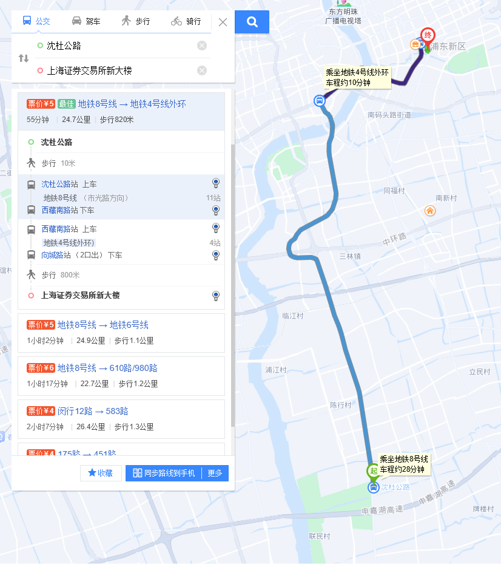  
</div>

通过搜索可知，当前附近距地铁站 10 分钟步行路程的小区，大致房价在 3.2 万/平米，由于当前无法查到历史成交价，只能按照整个城市的平均变化反推
<div align="center">
  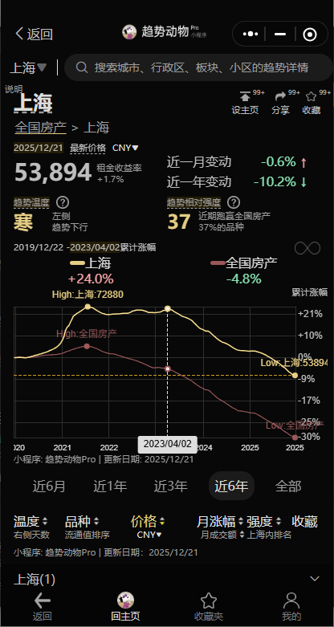
</div>

```
反推系数 = 72120 / 53894 = 1.3382
高峰期房价 = 反推系数 * 3.2万 = 4.28万
```

按照小新家的占地面积 150 平米计算(这里注意，由于国内只有建筑面积，没有占地面积，直接比较其实有偏差)，那么当时的价格为  
```
4.28万/平米 * 150平米 = 642万
```

### 贷款
虽然 23 年贷款利率较高，不过 2024 年，我国推出政策，将当时符合相应条件的存量住房贷款利率将统一批量调整为不低于贷款市场报价利率（LPR）减30个基点；23 年上海高点买入此房屋，首付 30%，那么贷款总额为 449 万，又由于我国的公积金政策，一般家庭可以选择组合贷款，即公积金贷款 120 万，剩余为商贷，所以按此计算等额本金和等额本息分别为  
<div align="center">
  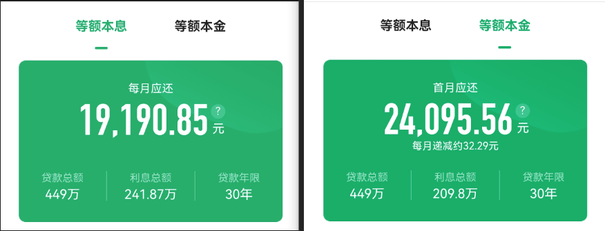
</div>

这里再将公积金考虑入内，由于各个单位缴纳比例不一致，有些单位按照 5% 存缴，有些单位按照 7% 还加额外的补充公积金，这里取夫妻双方个人和单位各自缴纳 7%，补充公积金均未缴纳，上面计算税前收入对应每月公积金收入加总为  

```
(500000 / 12) * (0.07 * 4) = 11666.67
```

选择等额本息，则每月贷款占税后收入比例约为:  
```
(19190.85 - 11666.67) / (406297 / 12) = 22.22%
```

选择等额本金，还款两年后的月供占税后收入比例约为:  
```
((24095.56 - 32.29 * 24) - 11666.67) / (406297 / 12) = 34.42%
```

如果能忍受和广志一样的极端通勤，即使是在上海房价的最高峰附近买入，当前每月还款压力也大幅低于小新一家，而且由于国内通常是双职工家庭，和日本的单职工+家庭主妇的组合相比，也有更强的抗风险能力。  

### 物价
价格来源
* 食品取自上海浦东发改委每日发布的[主副食品价格](https://www.pudong.gov.cn/pudong-interaction-front/fgw/food-price/list)，当前为 2025-12-26 的价格
* 牛奶价格取自光明牛奶的app: 光明随心订

| 商品 | 调查单位 | 价格 | 33858元(家庭税后收入均分12个月) |
| --- | --- | --- | --- |
| 粳米 | 500克(江苏产特二散装)(菜场) | 2.38 至 4.00 元 | 4232.25 至 7113.03 公斤 |
| 粳米 | 500克(东北产特二散装)(菜场) | 2.50 至 4.00 元 | 4232.25 至 6771.60 公斤 |
| 粳米 | 500克(东北产特二散装)(超市) | 2.28 至 2.88 元 | 5878.13 至 7425.00 公斤 |
| 花生油(鲁花) | 5升(桶装一级压榨)(菜场) | 141.90 至 171.00 元 | 990.00 至 1193.02 升 |
| 花生油(鲁花) | 5升(桶装一级压榨)(超市) | 149.90 至 173.90 元 | 973.49 至 1129.35 升 |
| 花生油(福临门) | 5升(桶装)(菜场) | 42.00 至 70.00 元 | 2418.43 至 4030.71 升 |
| 花生油(福临门) | 5升(桶装)(超市) | 49.90 至 68.90 元 | 2457.04 至 3392.59 升 |
| 鲜猪肉 | 500克(精瘦肉)(菜场) | 11.80 至 25.01 元 | 676.89 至 1434.66 公斤  |
| 鲜猪肉 | 500克(精瘦肉)(超市) | 14.28 至 16.8 元 | 1007.68 至 1185.5 公斤  |
| 鲜猪肉 | 500克(肋排)(菜场) | 12.40 至 38.00 元 | 445.5 至 1365.24 公斤  |
| 鲜猪肉 | 500克(肋排)(超市) | 19.80 至 23.80 元 | 711.3 至 855 公斤 |
| 鲜牛肉 | 500克(腱子肉)(菜场) | 37.80 至 68.00 元 | 248.95 至 447.86 公斤 |
| 鲜牛肉 | 500克(腱子肉)(超市) | 35.80 至 50.80 元 | 333.25 至 442.88 公斤 |
| 鲜牛肉 | 500克(牛腩)(菜场) | 28.00 至 63.00 元 | 268.71 至 604.61 公斤 |
| 鸡肉 | 500克(白条鸡、开膛、上等)(菜场) | 6.80 至 28.00 元 | 604.61 至 2489.56 公斤 |
| 鸡蛋 | 500克(新鲜完整 普通洋鸡蛋)(菜场) | 3.50 至 6.50 元 | 2604.46 至 4836.86 公斤 |
| 鸡蛋 | 500克(新鲜完整 普通洋鸡蛋)(超市) | 5.18 至 5.80 元 | 2918.79 至 3268.15 公斤 |
| 牛奶 | 500毫升(光明纯鲜牛奶新鲜屋) | 7.9 元 | 2142.91 升 |
| 牛奶 | 500毫升(光明优倍高品质鲜牛奶新鲜屋) | 12.1 元 | 1399.09 升 |

## 日本的宏观视角
看完了微观视角的对比，现在我们再来从宏观层面看看当年日本的情况。  

### 股市
在 1992 年底，日经 225 收报于 16924.95 点，较 1989 年 12 月 29 日的 38957.44 高点下跌了 57%；但这并不是短暂的股市暴跌，而是随后持续了二十多年的漫漫熊途；直到 2012 年底，日本股市才重新恢复上涨趋势，而回到 1989 年的顶点则还需要等到 2024 年。  
<div align="center">
  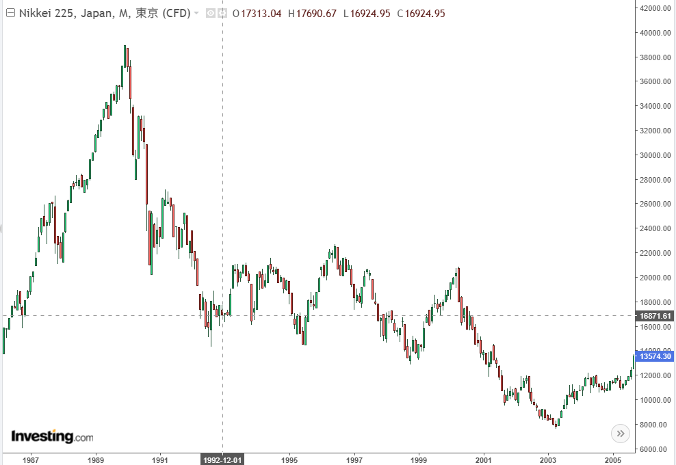
</div>

### 经济
站在 1992 年的时间点，很大部分日本人还对未来抱有幻想，觉得这只是一次短暂的调整，经济很快便能重回正轨，但是站在 2025 年的今天，我们都知道了事情的发展
* 失业率攀升
  * 日本完全失业率从 1990 年的 2.1% 持续攀升到 2002 年的 5.4%
  * 就业冰河期: 1993年开始，企业大规模缩减招聘应届毕业生，并且和上一代人不同，这一代人即使找到工作，也有很大部分是非正式员工的身份  
<div align="center">
    
</div>  

* 陷入通缩: 
  * 1991-1992年：CPI同比仍保持在2-3%左右
  * 1993-1995年：逐步下滑，部分月份跌破1%
  * 1994年7月：首次出现单月同比负增长
  * 1997年4月：消费税从3%上调至5%，CPI一度反弹至正值区间
  * 1998年4月：核心CPI同比跌至-0.1%，此后五年多时间内持续为负

<div align="center">
  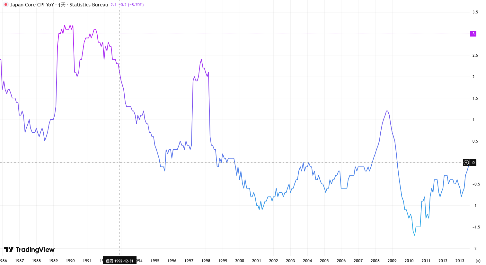  
</div>

* 金融业破产潮:
  * 1991年10月: 三和信用金库成为日本战后首家破产的金融机构
  * 1992年: 东邦相互银行、东洋信用金库倒闭
  * 1994年12月: 东京协和信用组合及安全信用组合宣布破产
  * 1995年: 宇宙信用组合、COSMO信用组合、木津信用也宣告倒闭，8月日本兵库银行倒闭，6月末七家“住专”不良债权总额高达 6.41万亿日元，占 1995财年金融机构不良债权总量的一半
  * 1997年11月: 亚洲金融危机已经爆发，海外市场的紧张氛围进一步冲击日本，三洋证券、北海道拓殖银行、山一证券、德阳城市银行等大型金融机构继宣布破产
  * 1998年: 日本长期信用银行、日本债券信用银行相继破产，并暂时实行国有化管理

**日本存款性金融机构破产件数**
| 财年 | 1991 | 1992 | 1993 | 1994 | 1995 | 1996 | 1997 | 1998 | 1999 | 2000 | 2001 | 2002 | 2003 | 2004-2008 | 合计 |
| --- | --- | --- | --- | --- | --- | --- | --- | --- | --- | --- | --- | --- | --- | --- | --- |
| 银行 | 1 | 0 | 0 | 0 | 2 | 1 | 3 | 5 | 5 | 0 | 2 | 0 | 1 | 0 | 20 |
| 信用金库 | 0 | 1 | 1 | 0 | 0 | 0 | 0 | 0 | 10 | 2 | 13 | 0 | 0 | 0 | 27 |
| 信用组合 | 0 | 0 | 1 | 4 | 4 | 4 | 14 | 25 | 29 | 12 | 41 | 0 | 0 | 0 | 134 |
| 合计 | 1 | 1 | 2 | 4 | 6 | 5 | 17 | 30 | 44 | 14 | 56 | 0 | 1 | 0 | 181 |

### 科技
90年代中后期，随着经济泡沫破裂，股市、楼市崩盘以及金融业破产潮的发生，日本企业面临巨大的财务压力，普遍进行战略收缩，削减高风险、长回报周期的研发投入。同时投资萎缩，由于股市的崩溃，股市的融资功能大幅被削弱，高风险、长周期且需要高额投入的科技产业在公开市场融资的可能性大幅降低。  
1991年喊出了"电子立国"的口号，但是却在 90 年代的半导体竞争中败下阵来，其后更是完全错过互联网、移动互联网的浪潮。  

## 对我国的借鉴意义
### 日本的教训
我国市面上论述日本失去二十年、三十年的书籍、资料多如牛毛，侧重点各不相同，例如
* 批评日本政府在危机刚发生时行动犹豫反复，从而导致后面的连锁反应
* 辜朝明提出的资产负债表衰退: 私人部门的高负债导致个人或企业普遍地偿还债务以增加储蓄，而不是消费或投资，进而导致经济增长放缓或下降
* 团块次代的悲惨人生: 作为日本战后的第二波婴儿潮出生的人群，毕业时迎面撞上了泡沫破裂，原本憧憬的美好人生大都无法实现；直到现在，日本厚生劳动省的网站中，还有专门的面向就业冰河期一代的工作支持的[网页](https://www.mhlw.go.jp/shushoku_hyogaki_shien/)  
<div align="center">
  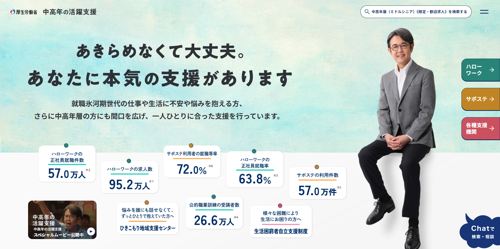  
</div>  

* **少子化浪潮**: 根据世界银行的数据，截至 2023 年，日本总和生育率已经跌至 1.2  
<div align="center">
  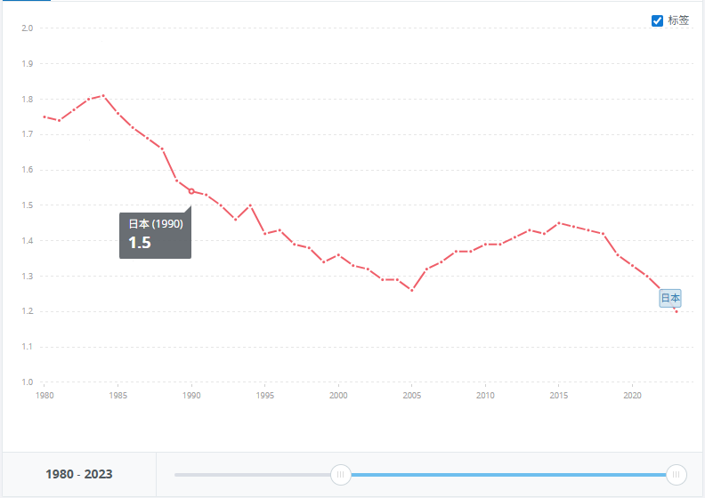
</div>

### 提前处置的风险
对比日本 90 年代的情况，我国目前总体情况则要好许多，就如达里奥与王岐山的对话中提到的  
> “有能力的人居安思危，安然无忧的是愚人。假如冲突能在变得尖锐之前被解决的话，世界上就不会有英雄了。”  

我国许多潜在的问题都在房产泡沫顶峰之前被提前处置了，例如
* 清理影子银行: 
  * 2016年底中央经济工作会议强调防范化解金融风险
  * 2017年初明确要弥补监管短板，治理市场乱象
  * 此后影子银行规模大幅压缩，P2P 至 2020 年底已经清零
* 对整个房地产杠杆的控制:
  * 2016年之后，房住不炒成为核心指导思想
  * 2020年三道红线对房企的负债率做出严格限制，压缩了银行对房企的房贷空间
  * 2021年严查严查经营贷违规流入楼市
  * 严格控制最低首付比例
* 提前处置银行业内的风险
  * 2019年在包商银行流动性尚未枯竭时就果断接管，避免挤兑蔓延至同业市场
  * 2020年底人民银行、银保监会发布《系统重要性银行评估办法》，完善现代金融监管体系、防范系统性金融风险，最终于 2023 年 9 月 22 日，第一次发布系统重要性银行名单
* 供给侧改革，主动淘汰落后、化解过剩产能

由于提前处置了风险，我国避免出现日本 90 年代那种，由银行兜底，保"住专"，保就业，没有及时淘汰落后产能，导致僵尸企业数量大幅上升，从而不良资产在银行业内淤积的问题，最终连环引爆大雷的情况。  

当前即使是一线城市的房价已经出现了 30% 以上的跌幅的情况下，我国系统重要银行的不良率依旧控制在较低水平。  

### 股市与科技
在本轮经济调整中，我国成功的避过了日本犯下的许多错误，虽然房产价格有很大幅度的下跌，但是由于风险的提前处置，经济其他方面不至于一起螺旋下降。  
二级市场融资功能保持强劲，从 deepseek 发布开始，我国科技股走出一波牛市，在股市中创造了财富效应，为科技公司融资提供了良好的条件。近年来半导体、通信、航天、人工智能等板块走势强势。  

### 少子化隐忧
如果说国内当前面临较大的灰犀牛，那当属日韩都掉进的深坑: 少子化！ 
<div align="center">
  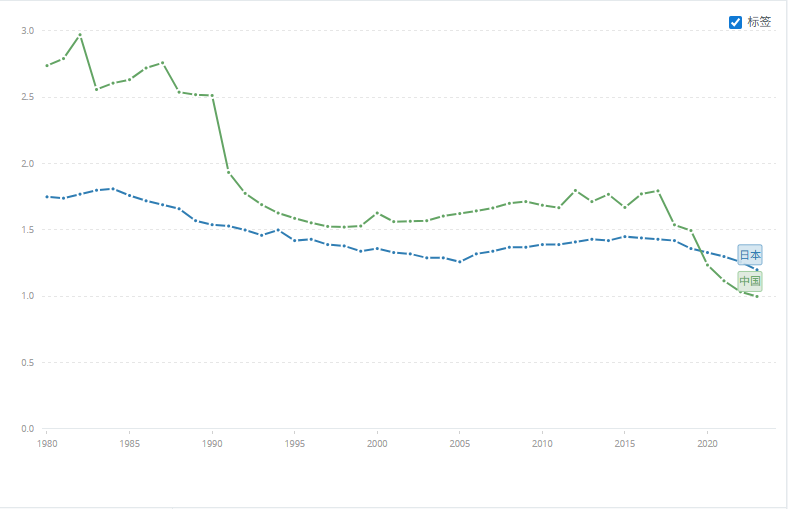 
  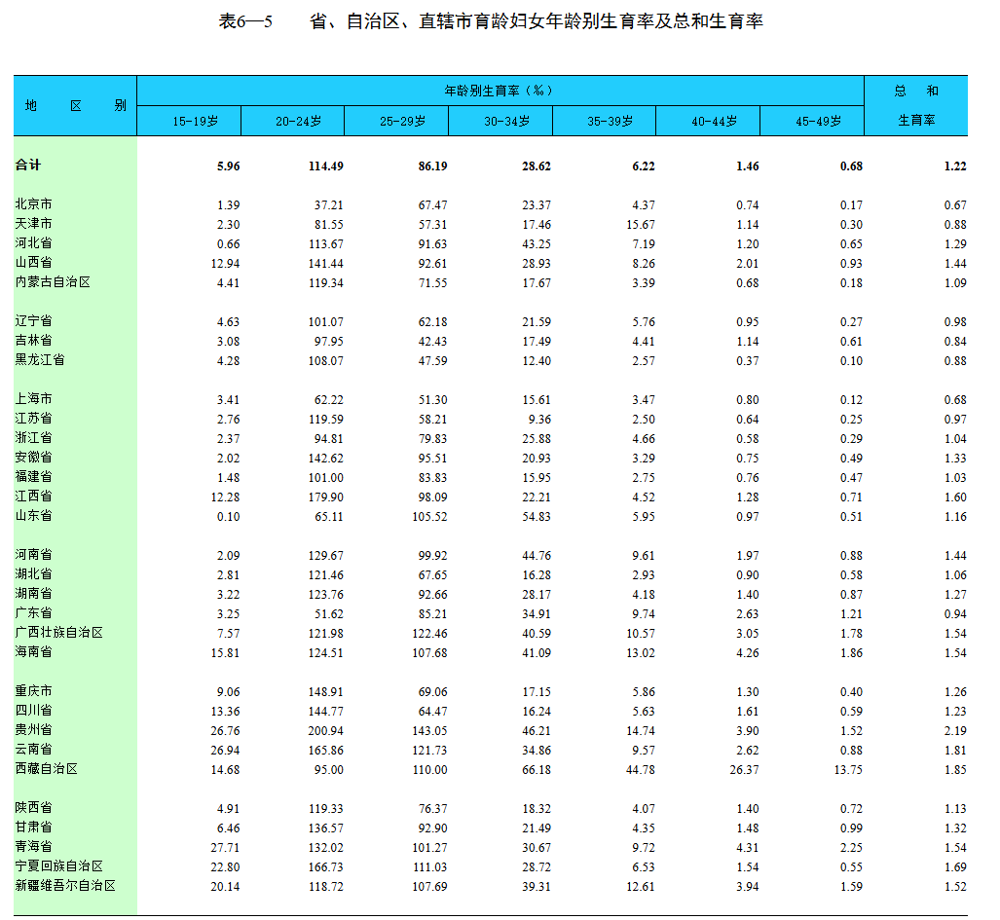  
</div>

按照世界银行的数据，2023 我国当前的总和生育率已跌至 1.0 的水平，比日本还低。我国统计局给出的数据，上海和北京的总和生育率都跌破 0.7，从前说大城市来一代人消灭一半人大家都以为是笑话，现在看确实属于地狱笑话了，实际情况是在一线城市一代人消灭人口的比例是 65%。  

作为一个 85 后，看着仅仅两代人的时间，断子绝孙已经由一句恶毒的咒骂，变成了许多人的自然选择，心里不免唏嘘。  

当然，关于人口与生育率是个很大的话题，这里也没法展开讨论，民间已有 梁建章、任泽平、黄文政 等人建立的 [育娲人口研究](https://www.yuwa.org.cn/) 长期跟踪此问题。  

## 结语
总体上上世纪九十年代日本是从房产到股市的高杠杆全方位的经济泡沫破裂，再加上日本政府的错误处置，导致危机最终引爆了整个金融系统，除此之外，还错过了后面的互联网浪潮。而我国目前的情况，房产下跌导致的风险并没有对金融造成系统性冲击，而且科技行业也没有停下脚步，AI 竞争当前基本仅剩中美两个玩家，电动车产业的发展带动了整条产业链，本年度前 11 个月贸易顺差甚至首次突破万亿美元大关，创下历史纪录。  

正如我的一位朋友所说:"日本和我们根本不具有可比性，一个是殖民地，一个是有完全主权的当前世界第一制造业国，无脑悲观唱空的都是XX"，对于此我也十分认同。诚然对于我国的发展有信心，但是"以史为镜可以知兴替"，日本踩过的坑对我们当下也极具借鉴意义，尤其是没能及时扭转少子化的趋势，对经济造成的长期影响难以估量。  

最后，花了这么大力气查资料，写了这么多内容，最想对老婆表达的还是:"野原广志都能生二胎，我觉得我也能  : )"  
